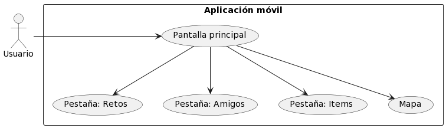
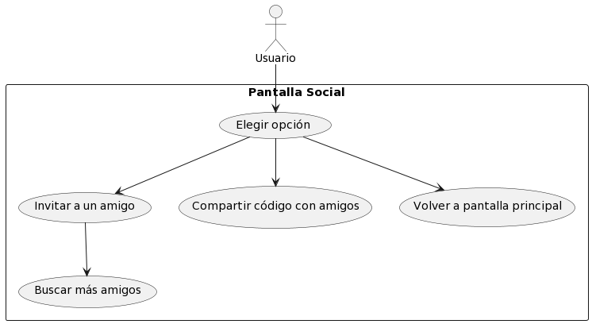
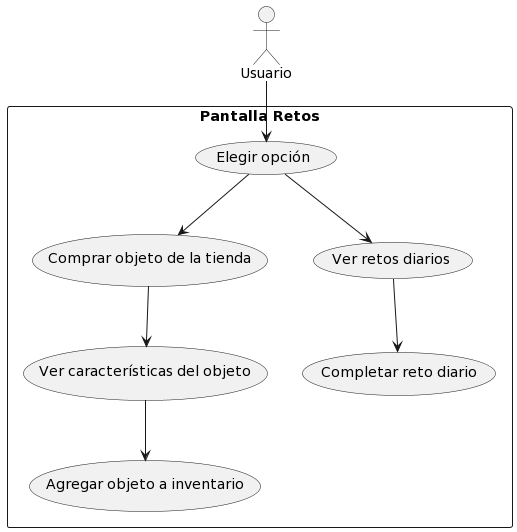

# CycloQuest

<h2>De que trata CycloQuest</h2>
CycloQuest es una aplicacion movil que busca crear un espacio inmersivo y divertido para todos aquellos que suelen ir en bicicleta o les gustaria empezar a hacerlo, con intensivos y una UI diseñada especificamente para incentivar a sus usuarios a:
<ul>
  <li>Hacer amigos</li>
  <li>Completar tareas</li>
  <li>Romper tus records!</li>
  <li>No perder la motivacion</li>
</ul>

Promueve la exploración de la ciudad en bicicleta y el contacto social a través de desafíos a medida y gratificaciones, mejorando la experiencia del ciclismo urbano. Su estructura adaptable permite generar ingresos mediante asociaciones estratégicas, brindando incentivos y ofertas que garantizan su sostenibilidad y crecimiento.

<h2>Casos de Uso</h2>
<h4>De la aplicacion</h4>
Pantalla Principal:

Pantalla Social:

Pantalla Retos:

<h1>Tareas de equipo para el desarrollo de la app</h1>
<ol>
    <li>New</li>
    <ul>
      <li>Integración de parqueadores con el Mapa Principal<li>
          <ul>
            <li>Implementar la funcionalidad de geolocalización para ubicar parqueaderos</li>
            <li>Desarrollar el sistema de filtrado de búsqueda en el mapa según preferencias de usuario</li>
            <li>Conectar la interfaz de usuario con el backend para mostrar los datos en tiempo real</li>
          </ul>
      <li>Desarrollo Backend para la creación de grupos<li>
      </ul>
  </li>
  <li>Aproved</li>
    <ul>
      <li>Desarrollo del Backend para CicloParqueaderos </li>
      <li> <li>
    <ul>
  <li>Commited</li>
    <ul>
      <li> <li>
      </ul>
  </li>
</ol>
